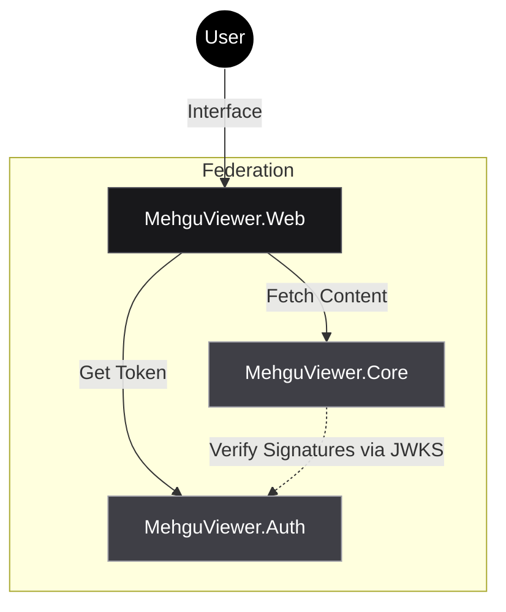

  <picture>
    
  </picture>

# <picture></picture> MehguViewer <picture></picture>

> **The High-Performance Federated Media Protocol.**

---

### **Manifesto**

**MehguViewer** is a distributed, specification-first ecosystem for hosting and consuming media. It decouples **Identity** (Auth) from **Content** (Core) to allow for a truly federated network where users own their data, and servers maximize performance.

*   **Stateless:** Core nodes do not hold user tables. Logic is driven by signed OIDC Claims.
*   **Native AOT:** Backends are compiled to native code for instant startup and minimal memory usage.
*   **Strict Types:** Communication requires strictly validated URNs and RFC 7807 error handling.

---

### **The Architecture**

The ecosystem is split into three strict architectural pillars.

### **Repository Directory**

| Repository | Role | Tech Stack | Status |
| :--- | :--- | :--- | :--- |
| 📐 **[MehguViewer.Proto](https://github.com/MehguViewer/MehguViewer.Proto)** | **The Source of Truth.** Documentation, OpenAPI Specs, and Design Guidelines. **Start here.** | `Fumadocs` `OpenAPI` | 🟢 **Active** |
| 🏗️ **[MehguViewer.Core](https://github.com/MehguViewer/MehguViewer.Core)** | **The Content Node.** Hosts images, handles comments, validates tokens. | `.NET 9` `Native AOT` | 🟡 **WIP** |
| 🔐 **[MehguViewer.Auth](https://github.com/MehguViewer/MehguViewer.Auth)** | **The Identity Provider.** Handles OIDC Logins and global blocklists. | `Node.js` `OIDC` | 🟡 **WIP** |
| 👁️ **[MehguViewer.Web](https://github.com/MehguViewer/MehguViewer.Web)** | **The Lens.** The universal client for any Auth+Core combination. | `Next.js` `React` | 🟡 **WIP** |

---

  MehguViewer Organization &copy; 2025

