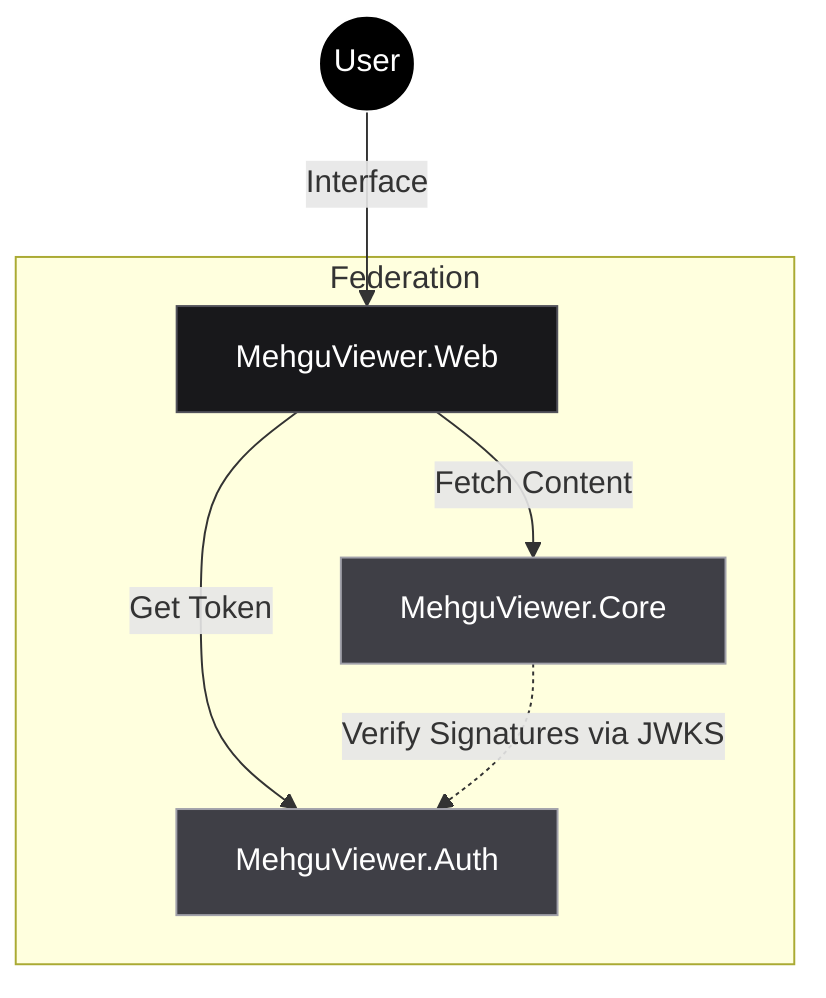

<div align="center">
  <picture>
    
  </picture>
</div>


# <picture></picture> MehguViewer <picture></picture>

> **The High-Performance Federated Media Protocol.**

[](./LICENSE)
[](https://github.com/MehguViewer/MehguViewer.Proto)
[](https://github.com/MehguViewer/MehguViewer.Core)

---

### **Manifesto**

**MehguViewer** is not just a manga reader. It is a **distributed, specification-first ecosystem** for hosting and consuming media. It decouples **Identity** (Auth) from **Content** (Core) to allow for a truly federated network where users own their data, and servers maximize performance.

*   **Stateless:** Core nodes do not hold user tables. Logic is driven by signed OIDC Claims.
*   **Native AOT:** Backends are compiled to native code for instant startup and minimal memory footprint.
*   **Industrial Design:** The UI prioritizes data density, keyboard navigation, and rigid layouts.

---

### **The Architecture**

The ecosystem is split into three strict architectural pillars.



### **Repository Directory**

| Repository | Role | Tech Stack | Status |
| :--- | :--- | :--- | :--- |
| 📐 **[MehguViewer.Proto](https://github.com/MehguViewer/MehguViewer.Proto)** | **The Source of Truth.** Contains the Documentation, OpenAPI Specifications, and Design Guidelines. **Start here.** | `Fumadocs` `OpenAPI` `MDX` | 🟢 **Active** |
| 🏗️ **[MehguViewer.Core](https://github.com/MehguViewer/MehguViewer.Core)** | **The Content Node.** Hosts images/media, handles local comments, and validates tokens. | `.NET 9` `Native AOT` `SQLite` | 🟡 **WIP** |
| 🔐 **[MehguViewer.Auth](https://github.com/MehguViewer/MehguViewer.Auth)** | **The Identity Provider.** Handles OIDC Logins, global blocklists, and leveling profiles. | `Node.js` `OIDC Provider` | 🟡 **WIP** |
| 👁️ **[MehguViewer.Web](https://github.com/MehguViewer/MehguViewer.Web)** | **The Lens.** The universal client that connects to any Auth+Core combination. | `Next.js` `React` `Tailwind` | 🟡 **WIP** |

---

### **Key Technologies**

*   **URN Identifiers:** We use `urn:mvn:series:{uuid}` and `urn:mvn:user:{uuid}` to ensure type safety and easy asset federation across nodes.
*   **Snapshotting:** Since Nodes are stateless, user data (Name/Avatar) is "snapshotted" onto Comments at the time of posting.
*   **RFC 7807:** All APIs return strictly typed "Problem Details" for robust error handling.

### **Getting Started**

We follow a **Specification-Driven Development** workflow.

1.  **Read the Docs:** Visit [The Proto Documentation Site](https://proto.mehguviewer.kazeo.xyz) to understand the handbook.
2.  **Run the Stack:**
    ```bash
    # Clone the Core
    git clone https://github.com/MehguViewer/MehguViewer.Core
    cd MehguViewer.Core
    dotnet run
    ```
3.  **Join the Federation:** Configure your Client (`.Web`) to point to your new local Node.

---

<div align="center">
  <sub>MehguViewer Organization &copy; 2025</sub>
</div>
